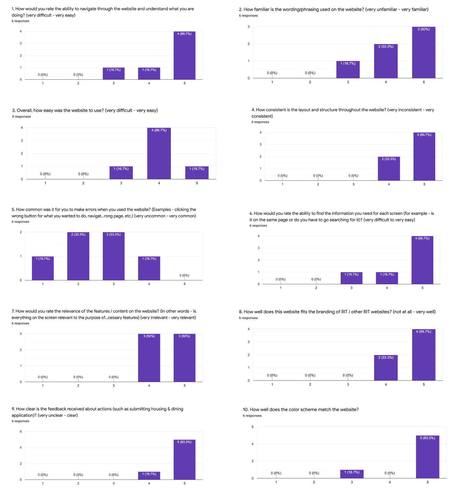

## High Fidelity Evaluation
*[Home](index.md)*

*[Homework 2 - Lofi Prototype](lofi.md)*

*[Homework 3 - Lofi Prototype Evaluation](lofi_evaluation.md)*

*[Homework 4 - Hifi Prototype](hifi.md)*
### Overview
We have decided to test our high fidelity prototype by having the partipants sign a consent form to be recorded, and then using Zoom to gain the ability to record both the screen and the participant at the same time. We will be asking them to walk through specific tasks, which are aimed to test the features we had to improve from our low fidelity prototype. We will also be having the participants complete a short heuristic survey to see how we have improved the design from the low fidelity prototype.

We are recording the usability tests because our team has conflicting schedules and we will not be able to all meet with the participants at the same time. This allows us to watch all of the tests, and also allows us to rewatch to take more notes, if necessary.

Both the consent form and script are based on the consent form/initial script templates from Rocket Surgery Made Easy website.

#### Consent Form
The consent form can he found here: *[Consent Form PDF](consent_form.pdf)*

All participants had to sign before conducting the test, because will be sharing the recording of their test.

#### Initial Script
When we begin the test, here is the script to be followed to ensure all participants begin with the same information. This was done before the recording was started, because the consent form was signed after this script:

Hi, I'm going to be walking you through this test today. Before we start, we have some information for you. You may have some idea of why we asked you to be here today, but I will go over it again briefly. We are looking to test our high fidelity prototype in order to analyze our improvements from our low fidelity prototype. The first thing I want to make clear right away is that we’re testing our design, not you. You can’t do anything wrong here or make any mistakes.
You will be asked a series of tasks to complete, and I encourage you to talk through your thinking and what you're trying to do, so that I can take notes and understand your thought process. After these tasks have been completed, you will be asked to fill out a short google form.
Also, please don’t worry that you’re going to hurt our feelings. We’re doing this to improve the site, so we need to hear your honest reactions. If you have any questions as we go along, just ask them. I may not be able to answer them right away, since we’re interested in how people do when they don’t have someone sitting next to them to help. But if you still have any questions when we’re done I’ll try to answer them then. And if you need to take a break at any point, just let me know.
Lastly, you will be asked to sign a consent form in order to allow me to record your screen and your comments via zoom. Once this form is signed we will begin the test.

#### Tasks
Here are the tasks we assigned each participant, in order, to evaluate our prototype:
1. You no longer need campus housing and you want to change your meal plan for the 21-22 academic year. Log in and edit the meal plan, and then cancel your 21-22 housing request.
2. Although this would typically be done at a later time, please complete both the housing and dining applications for 22-23 academic year.
3. Go to complete the pending form.

#### Evaluation Form
The evaluation form that the participants are completing after going through the tasks can be found *[here](https://forms.gle/RcCZQAJNt1nHjJfH8)*

### Analysis and Results
Overall, it seems like our new housing and dining set up works well, with a few minor issues to fix. The responses on the google form Likert scale questions were mostly all positive. A lot of people answered positively to the short answer question asking about what they thought of the housing & dining application, saying things like "It is convenient" and "it’s overall pretty clear and easy to use" and "I thought it was very well organized and easy to navigate." The layout appears to have more clarity, and the main issues now are due to prototyping errors minor confusion between the separation of housing and dining when they are going to 'edit'. And there are still some errors that users are making, as the only Likert scale question where people answered somewhat negatively was the one asking how common it was to make errors (and some said it was fairly common - an answer of 4). We also had to alter our tasks for clarity after Renee had tested her participants (participants #1 and #2), because we realized the questions were poorly ordered and worded, so we fixed that before testing our last 4 participants. At first, we had the participants go through an old year housing application, then a new year housing application, and then an old year housing application again (which wouldn't make sense in real life but we wanted to test an application that had been filled out already and an application that had not been filled out already). After the first two participants, we realized that this was confusing and the participants were not following the prompts correctly, so we could not properly test our prototype with these prompts, and so we changed them to the ones above for the last four participants.

#### Specific Participant Results

1. Participant 1:
The participant was easily able to login and find the housing & dining application for the changing the meal plan task. They used the top navigation in order to navigate the housing & dining application. When going to select the meal plan to change it, they hesitated at first and made a comment about how they thought it would be under housing. But when they couldn't it there, they found it below the housing tab pretty quickly. For the task to complete the housing & dining applications for the 22-23 academic year, the participant did not go back to the housing & dining application, but stayed in the 21-22 academic year. They were confused, but eventually went through the housing flow. For the cancel housing task, the participant was easily able to find the housing application and went right to the modify or cancel section. Lastly, they were easily able to find the pending form. 

2. Participant 2:
This participant was able to complete all of the tasks. They were able to edit the meal plan and go through the entire housing & dining flow. They moved from the housing part of the application to the meal plan part of the application by clicked on the meal plan button that pops up after clicking on submit for the housing portion. They were also easily able to find the cancel portion of the housing contract, as well as the pending form for those tasks.

-- Participants with Changed Tasks --  

3. Participant 3:
This participant experienced some confusion while editing the 21-22 meal plan and cancelling housing. She had saved and exited after cancelling the housing, rather than jumping right to meal plan as we had intended with our design. This is most likely because she had not noticed the meal plan button, as the edit page defaults to the full housing application menu. Additionally, she did not complete the meal plan in the second task, she had also hit save and exit and did not go back. This all could be confusion with the save and exit button as well. She had no trouble finding the pending form.

4. Participant 4:
This participant had a minor issue with the save and exit as well, when he edited the meal plan he exited editing the application, and then quickly went back in to cancel housing. He was able to smoothly navigate the rest of the site well, and mainly used the top navigation. Once he was on the home page, finding the pending form was very quick and easy.

5. Participant 5:
This participant was able to jump from housing straight to the meal plan successfully in the first task. In the second task this participant was also able to complete it quickly and as efficiently as we intended. In the final task the participant was able to find the form quickly, but got confused on whether he could click on the form in the warning or just in the list of links.

6. Participant 6:
This participant had some confusion when editing their 21-22 meal plan and cancelling housing in the first task. She jumped right to the meal plan and skipped housing then submitted and exit, so she had to go back into the housing / dining section to cancel the housing. During the second task the participant got confused on whether they were in the 21-22 application or the 22-23 application, so she filled out the 21-22 section instead of 22-23 as was intended. This may mean we need a more clear indicator for which application you are filling out while in the forms. The participant also was confused on whether they could click on the pending form in the third task or if they had to click on the blue link below it.

#### Video Recordings
The recordings of the audio and screen of the participants can be found in this google drive folder *[here](https://drive.google.com/drive/folders/1KyHpb_v4S6cGjn2kiVPZXTvCSSd4evgA?usp=sharing)*. We used these videos as a way to share results with other group members, as we were unable to conduct our tests together due to scheduling conflicts. 

#### Evaluation Form Graphs and Results
Here are the graphical results for our evaluation form that the participants completed after walking through the tasks:

#### Conclusion and Takeaways
The usability of our prototype increased from our low fidelity prototype to our high fidelity prototype. We were able to pinpoint more specific errors with the user flow on this round of testing, due to the prototype being more advances. Some issues we would fix if we were to continue this project would be:
1. The user flow to edit the 21-22 housing and dining application automatically opened the housing application, and some of our participants missed the 'meal plan' tab at first glance. We would change this to match the 22-23 begin application flow, where the landing page does not default to a specific application, and the users can choose either housing or dining.
2. There appeared to be issues with the save and exit buttons, some of the participants selected this between housing and dining applications in order to save, but then they just had to go back into the application later. A way to fix this would be to just have a 'save and continue' and a 'save' button, and then an 'x' to exit in the top, which should limit accidental exiting.
3. Some participants faced confusion with the pending form box at the top of the forms page because there's two links to the same form. Instead, there could be no pending form box at the top of the page and the forms that are pending could just have a box around them or a star next to them or some indication/label that the form is pending. This would help it stand out from the other forms, but be more discrete and less confusing than the entire box at the top and this way there would only be one link for users to click on.
4. There was also some confusion with the different housing & dining applications for different years. Some of this may be the way that our prompts were set up or the fact that people weren't filling this out for real. When someone is actually filling it out, they would probably understand to use the current/upcoming year. Still, it may help to make to make it more clear for the user what year they are filling out the housing & dining application. This could be done by putting the year on the top of the pages in the actual housing & dining application sections and/or making past year housing & dining applications only be able to be viewed, but not able to be edited.

Some issues with confusion had to do with the prototype software itself, because not all the buttons were fully interactive. The separation of housing and dining that we added for the hifi prototype eliminated the modify and cancel confusion, and the main issues were with confusion on what was clickable or not. This can be seen in our evaluation form question 5, as the results are very scattered. From here, we would continue to analyze these small issues to make our redesign as effective as possible.
