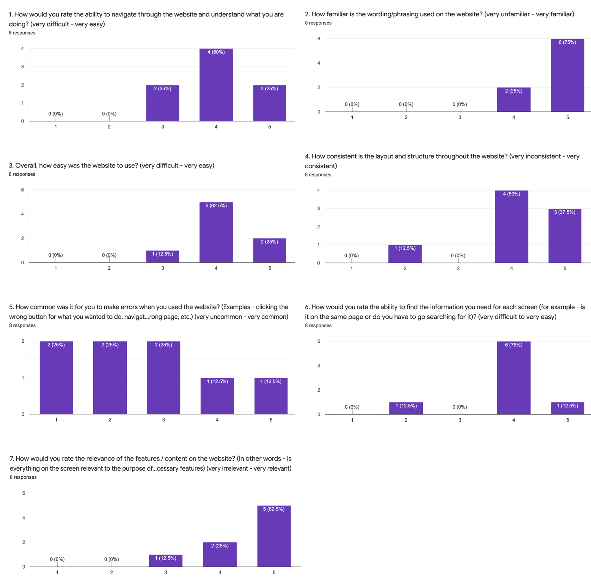

## Lofi Prototype Evaluation
*[Home](index.md)*

*[Homework 2 - Lofi Prototype](lofi.md)*

### Our Method
Each group member met with two people in person and had them talk through specific tasks. Our group members read the welcome script and then recorded important details from their interactions and conversations as the participants were attempting the tasks. The partipants were asked to complete one task at a time, in the order that they appear below. After the tasks were completed, the participants received a google form to evaluate the heuristics of the website. At the end, we will thank our participants and see if they any remaining questions.

#### Welcome Script to all Participants
We are looking to test our prototype for the RIT myLife website to see if it works as we planned it. We want to make it known that you can't make any mistakes or do anything wrong. We are doing this to test our design. And we also really appreciate your honest feedback on our design. So don't worry about criticizing it or worry that you will hurt our feelings, we just want your honest reaction. If you have any questions, feel free to ask them, although we may not want to answer at the time since we want to pretend as if you are trying to use this on your own. Feel free to ask any questions at the end as well. We are going to ask you to complete some tasks and we would appreciate if you would talk your way through the interactions and explain your thinking. After we complete the tasks, we are just going to ask you to fill out a quick survey about the prototype.

#### Tasks Assigned to Participants
1. You are an RIT Student and you need to log in and set up a housing and meal plan for the next school year.
2. Submit a maintenance request for your bedroom.
3. Go back and change the meal plan that you selected for next year.
4. Find the roommate agreement.

#### Heuristic Evaluation
These are the heuristic questions that were sent to the participants as a google form after they finished walking through the tasks. They will fill this out at the end. Here is the link: *[Google Form](https://forms.gle/yUhhGjhq3xpJWHNP7)*
1. How would you rate the ability to navigate through the website and understand what you are doing? 
2. How familiar is the wording/phrasing used on the website?
3. Overall, how easy was the website to use? 
4. How consistent is the layout and structure throughout the website?
5. How common was it for you to make errors when you used the website? (Examples - clicking the wrong button for what you wanted to do, navigating to the wrong page, etc.)
6. How would you rate the ability to find the information you need for each screen (for example - is it on the same page or do you have to go searching for it)?
7. How would you rate the relevance of the features / content on the website? (In other words - is everything on the screen relevant to the purpose of the app or are there unnecessary features)
8. Do you have any additional comments about the website design? (Especially anything about navigation or layout)

### Our Results

#### Observational Findings
Housing and Dining 
- THere was confusion when going to edit the meal plan, users did not know where to go to edit meal plan
- It is unclear if they can jump from section to section on the housing application when they go back to edit
- Some users wanted feedback at the end of the housing and dining application for confirmation
- It was unclear where the roommate agreement form was found
- Confusion on what the meal plan option meant (stripes, tiger, claws, etc)

Maintenance
- Confusion with the shared jobs and my jobs toggle
- 'More information' tab was unclear and vague
- Confusion on if jobs meant maintenance requests or maintenance employment

#### Heuristic Evaluation Findings

Here are the graphs generated by the 8 participants.

#### What to Change and Improve

We would like to improve the housing and dining application process by separating the housing process from the meal plan process to elimate confusion. The subsections for housing would be under housing, and all the meal plan subsections would be grouped as well. This would make the process to change and edit less confusing. We would also like to add more instruction before completing the application for first time users, so they do not get confused. Adding an explanation on what each meal plan option entails would help the user. It would also be helpful to add a feedback page to thank them for submitting, and maybe add links to follow up forms (such as the roommate agreement form). It should also be made more clear that users can click on the left links when going back to edit their housing application. The first time they fill out these sections, this would be blocked, so they cannot jump forward. The specific meal plan options link should be more clear, so that users know they can find more information on each plan.

On the maintenance page, the shared and my jobs section should be simplified and combined into one submission request to make it easier to use. The term 'more information' should be changed for clarity.
